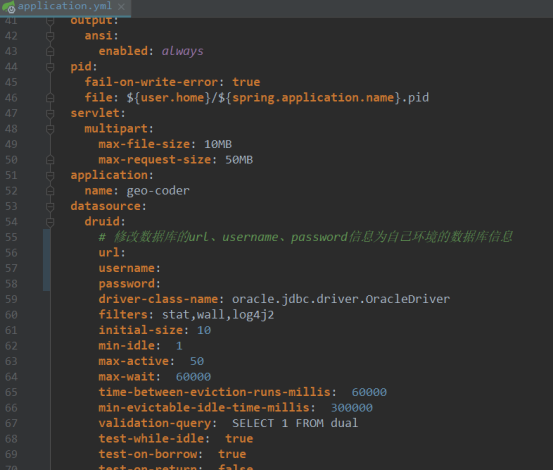
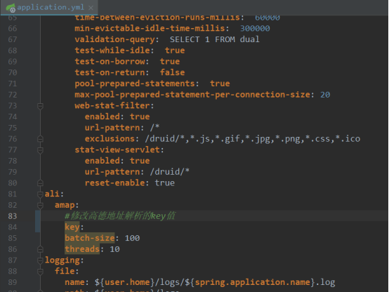

 1. 修改application.yml配置文件
    - 修改数据库连接信息
 
    - 修改高德地址解析key信息
  
 2. 部署、启动
    - 准备
      安装java环境
    -  部署、启动
``` shell?linenums
#  使用如下命令启动
nohup java  -jar geocoder.jar --spring.config.location=./application.yml &
```

